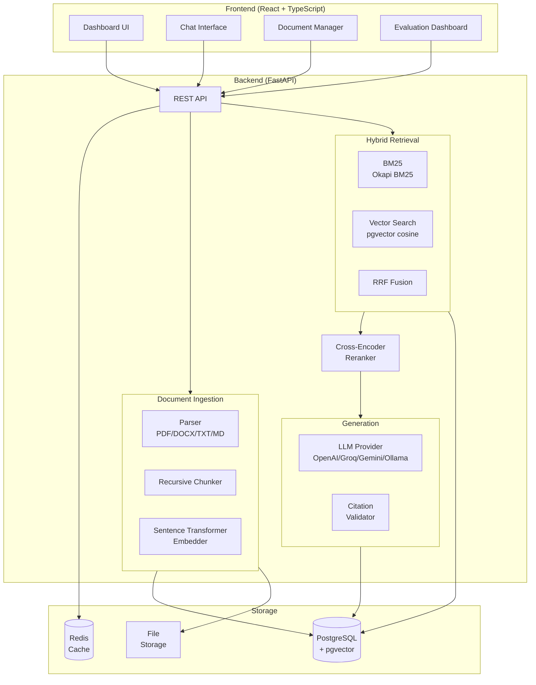
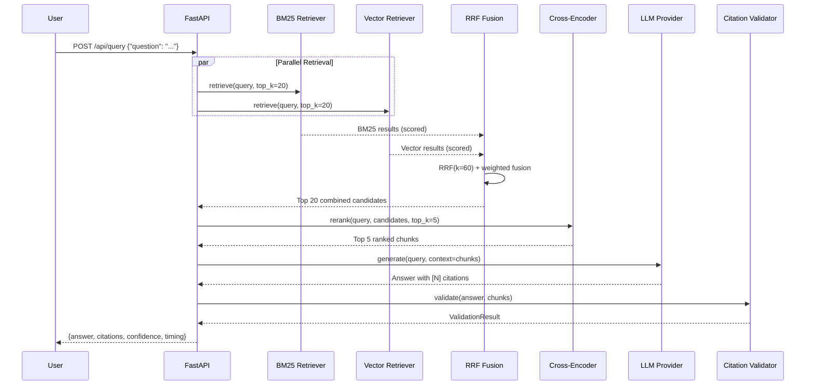

# Ask My Docs

> **"Turn your documents into an intelligent knowledge base."**


A **production-grade enterprise RAG (Retrieval-Augmented Generation)** application that answers questions about your documents using **hybrid BM25 + vector search**, **cross-encoder reranking**, and **citation-enforced generation**.

---

## Table of Contents

1. [Overview](#overview)
2. [Features](#features)
3. [Architecture](#architecture)
4. [RAG Pipeline](#rag-pipeline)
5. [Tech Stack](#tech-stack)
6. [Project Structure](#project-structure)
7. [Quick Start](#quick-start)
8. [Environment Variables](#environment-variables)
9. [Running Locally](#running-locally)
10. [Running with Docker](#running-with-docker)
11. [Running Tests](#running-tests)
12. [Running Evaluation](#running-evaluation)
13. [CI/CD](#cicd)
14. [API Reference](#api-reference)
15. [Contributing](#contributing)
16. [License](#license)

---

## Overview

**Ask My Docs** transforms your organization's documents into an intelligent, queryable knowledge base. Unlike simple chatbots, it uses a multi-stage retrieval pipeline to ensure every answer is grounded in your actual documents, with verifiable citations.

Users upload PDFs, Word documents, Markdown files, CSVs, or plain text — the system chunks, embeds, and indexes them automatically. Queries trigger a parallel BM25 + semantic search, followed by cross-encoder reranking and a strictly citation-constrained LLM generation step. The result: high-precision answers with traceable sources.

---

## Features

### RAG Architecture
- **Hybrid Retrieval** — BM25 (Okapi BM25) + pgvector cosine semantic search run in parallel
- **RRF Fusion** — Reciprocal Rank Fusion combines both ranked lists into a single candidate set
- **Cross-Encoder Reranking** — `sentence-transformers` cross-encoder re-scores top-20 candidates down to top-5
- **Citation Enforcement** — every answer contains `[N]` inline citations validated against retrieved chunks
- **Hallucination Protection** — LLM is strictly constrained to provided context via system prompt
- **Confidence Indicators** — High / Moderate / Insufficient evidence labels per query

### Document Management
- Upload **PDF, DOCX, TXT, Markdown, CSV**
- Drag-and-drop interface with real-time progress tracking
- Intelligent **recursive character chunking** with configurable size and overlap
- Full **metadata preservation** (page number, section, source document)
- **Document collections** for scoped, topic-specific retrieval

### Evaluation
- **Retrieval**: Recall@K, Precision@K, MRR, Hit Rate
- **Generation**: Faithfulness, Answer Relevance, Context Relevance
- **Citation**: Accuracy and Coverage
- **CI-gated quality gates** via GitHub Actions
- **Historical tracking** with JSON report storage

### Production Ready
- Docker + Docker Compose (single command deploy)
- PostgreSQL 16 + pgvector extension
- Redis 7 caching layer
- Structured JSON logging via `structlog`
- Rate limiting and security headers
- Comprehensive test suite (unit + integration)
- GitHub Actions CI/CD pipelines

---

## Architecture



---

## RAG Pipeline



---

## Tech Stack

| Layer | Technology |
|-------|-----------|
| Backend | Python 3.11, FastAPI, SQLAlchemy 2.0, Alembic |
| AI / ML | sentence-transformers, cross-encoder |
| Retrieval | rank-bm25 (BM25Okapi), pgvector |
| LLM | OpenAI / Groq / Gemini / Ollama |
| Database | PostgreSQL 16 + pgvector |
| Cache | Redis 7 |
| Frontend | React 18, TypeScript 5, Vite |
| UI | Tailwind CSS, shadcn/ui, Radix UI |
| Charts | Recharts |
| State | Zustand, TanStack Query |
| DevOps | Docker, Docker Compose, GitHub Actions |
| Testing | pytest, pytest-asyncio, httpx |

---

## Project Structure

```
ask-my-docs/
├── .env.example                    # Environment variable template
├── .gitignore
├── docker-compose.yml              # Full stack: postgres, redis, backend, frontend
├── Makefile                        # Convenience targets (test, evaluate, lint)
│
├── .github/
│   └── workflows/
│       ├── ci.yml                  # Backend tests + frontend lint/typecheck/build
│       └── rag-evaluation.yml      # CI-gated RAG quality gates
│
├── backend/
│   ├── Dockerfile
│   ├── alembic.ini
│   ├── requirements.txt
│   ├── alembic/
│   │   ├── env.py
│   │   └── versions/
│   │       └── 001_initial.py      # Initial schema migration
│   │
│   ├── app/
│   │   ├── main.py                 # FastAPI app factory
│   │   ├── api/                    # Route handlers
│   │   │   ├── deps.py             # Dependency injection (DB session, settings)
│   │   │   ├── query.py            # POST /api/query
│   │   │   ├── documents.py        # Document CRUD + upload
│   │   │   ├── collections.py      # Collection management
│   │   │   ├── evaluation.py       # Evaluation endpoints
│   │   │   ├── analytics.py        # Analytics & metrics
│   │   │   ├── feedback.py         # User feedback
│   │   │   └── health.py           # Health check
│   │   ├── core/
│   │   │   ├── config.py           # Pydantic Settings (all env vars)
│   │   │   ├── database.py         # Async SQLAlchemy engine + session
│   │   │   ├── logging.py          # structlog configuration
│   │   │   └── security.py         # JWT / token utilities
│   │   ├── models/                 # SQLAlchemy ORM models
│   │   │   ├── document.py
│   │   │   ├── chunk.py            # Chunks with pgvector embedding column
│   │   │   ├── collection.py
│   │   │   ├── query.py
│   │   │   ├── feedback.py
│   │   │   └── evaluation.py
│   │   ├── schemas/                # Pydantic request / response schemas
│   │   │   ├── document.py
│   │   │   ├── query.py
│   │   │   ├── collection.py
│   │   │   ├── evaluation.py
│   │   │   ├── feedback.py
│   │   │   └── analytics.py
│   │   ├── rag/
│   │   │   ├── ingestion/
│   │   │   │   ├── parsers.py      # PDF/DOCX/TXT/MD/CSV parsers
│   │   │   │   ├── chunker.py      # Recursive character chunker
│   │   │   │   └── pipeline.py     # Ingestion orchestrator
│   │   │   ├── retrieval/
│   │   │   │   ├── bm25.py         # BM25Okapi retriever
│   │   │   │   ├── vector.py       # pgvector cosine retriever
│   │   │   │   └── hybrid.py       # RRF fusion of BM25 + vector
│   │   │   ├── reranking/
│   │   │   │   └── cross_encoder.py
│   │   │   ├── generation/
│   │   │   │   ├── llm.py          # LLM adapter (OpenAI/Groq/Gemini/Ollama)
│   │   │   │   └── prompts.py      # System + context prompt templates
│   │   │   └── citations/
│   │   │       ├── parser.py       # [N] citation extraction
│   │   │       └── validator.py    # Citation-to-chunk grounding validation
│   │   ├── services/
│   │   │   ├── document_service.py
│   │   │   ├── analytics_service.py
│   │   │   └── evaluation_service.py
│   │   └── evaluation/
│   │       ├── metrics.py          # Recall@K, MRR, Faithfulness, etc.
│   │       └── runner.py           # Evaluation run orchestrator
│   │
│   ├── evaluation/
│   │   └── scripts/
│   │       └── run_ci_evaluation.py
│   │
│   └── tests/
│       ├── conftest.py             # Fixtures: async DB, test client, sample data
│       ├── unit/
│       │   ├── test_chunker.py
│       │   ├── test_bm25.py
│       │   ├── test_hybrid.py
│       │   └── test_citations.py
│       └── integration/
│           ├── test_documents.py
│           └── test_query.py
│
├── frontend/
│   ├── Dockerfile
│   ├── nginx.conf
│   ├── index.html
│   ├── package.json
│   ├── vite.config.ts
│   ├── tailwind.config.ts
│   ├── tsconfig.json
│   └── src/
│       ├── main.tsx
│       ├── App.tsx                 # Router setup
│       ├── index.css               # Tailwind base styles
│       ├── types/
│       │   └── index.ts            # Shared TypeScript types
│       ├── lib/
│       │   ├── api.ts              # Axios client + typed API calls
│       │   └── utils.ts            # cn() and helpers
│       ├── stores/
│       │   └── theme-store.ts      # Zustand dark/light theme store
│       ├── hooks/
│       │   ├── useQuery.ts         # TanStack Query: submit + history
│       │   ├── useDocuments.ts
│       │   ├── useCollections.ts
│       │   ├── useEvaluation.ts
│       │   └── useAnalytics.ts
│       ├── pages/
│       │   ├── LandingPage.tsx
│       │   ├── DashboardHome.tsx
│       │   ├── AskPage.tsx         # Main chat interface
│       │   ├── DocumentsPage.tsx
│       │   ├── CollectionsPage.tsx
│       │   ├── EvaluationPage.tsx
│       │   ├── AnalyticsPage.tsx
│       │   └── SettingsPage.tsx
│       └── components/
│           ├── layout/             # DashboardLayout, Header, Sidebar
│           ├── chat/               # ChatMessage, ChatInput, CitationBadge, SourcePanel
│           ├── documents/          # DocumentCard, DocumentUpload, ChunksViewer
│           ├── evaluation/         # EvaluationChart, MetricsTable, EvaluationRunCard
│           ├── analytics/          # MetricCard, QueriesChart, LatencyChart
│           └── ui/                 # shadcn/ui primitives
│
└── evaluation/
    ├── datasets/
    │   └── sample_eval.json        # Sample evaluation dataset (Q&A pairs)
    ├── reports/
    │   └── latest.json             # Latest evaluation run results
    └── scripts/
        └── run_ci_evaluation.py    # Standalone evaluation runner
```

---

## Quick Start

### Prerequisites

- **Docker** and **Docker Compose** v2+
- At least one LLM API key (**OpenAI**, **Groq**, or **Gemini**) — _or_ [Ollama](https://ollama.ai) running locally

### 1. Clone

```bash
git clone https://github.com/yourorg/ask-my-docs.git
cd ask-my-docs
```

### 2. Configure

```bash
cp .env.example .env
# Open .env and set your LLM API key (e.g. OPENAI_API_KEY=sk-...)
```

### 3. Start

```bash
docker compose up --build
```

This starts PostgreSQL 16 + pgvector, Redis 7, the FastAPI backend, and the React frontend.

### 4. Open

Navigate to **http://localhost:3000** — the dashboard is ready.

---

## Environment Variables

| Variable | Description | Default |
|----------|-------------|---------|
| `DATABASE_URL` | PostgreSQL async DSN (asyncpg) | _(required)_ |
| `SECRET_KEY` | Random secret for token signing | _(required)_ |
| `REDIS_URL` | Redis connection URL | `redis://localhost:6379` |
| `LLM_PROVIDER` | LLM backend: `openai` \| `groq` \| `gemini` \| `ollama` | `openai` |
| `LLM_MODEL` | Model name passed to the provider | `gpt-4o-mini` |
| `OPENAI_API_KEY` | OpenAI API key | _(optional)_ |
| `GROQ_API_KEY` | Groq API key | _(optional)_ |
| `GEMINI_API_KEY` | Google Gemini API key | _(optional)_ |
| `OLLAMA_BASE_URL` | Base URL for local Ollama instance | `http://localhost:11434` |
| `EMBEDDING_MODEL` | Sentence-transformers model for embeddings | `sentence-transformers/all-MiniLM-L6-v2` |
| `RERANKER_MODEL` | Cross-encoder model for reranking | `cross-encoder/ms-marco-MiniLM-L-6-v2` |
| `CHUNK_SIZE` | Characters per chunk | `512` |
| `CHUNK_OVERLAP` | Overlap between consecutive chunks | `64` |
| `BM25_WEIGHT` | BM25 weight in hybrid fusion | `0.4` |
| `VECTOR_WEIGHT` | Vector weight in hybrid fusion | `0.6` |
| `TOP_K_RETRIEVAL` | Candidates retrieved per method | `20` |
| `TOP_K_FINAL` | Final chunks passed to LLM | `5` |
| `MAX_FILE_SIZE_MB` | Maximum upload file size | `50` |
| `UPLOAD_DIR` | Local directory for uploaded files | `uploads` |
| `LOG_LEVEL` | Logging level (`DEBUG`, `INFO`, `WARNING`) | `INFO` |
| `CORS_ORIGINS` | JSON list of allowed CORS origins | `["http://localhost:5173","http://localhost:3000"]` |
| `RATE_LIMIT_PER_MINUTE` | API rate limit per client per minute | `60` |

---

## Running Locally

Run the backend and frontend independently without Docker (use Docker only for the databases).

### Backend

```bash
# 1. Create and activate a virtual environment
python -m venv venv
source venv/bin/activate        # Windows: venv\Scripts\activate

# 2. Install dependencies
pip install -r backend/requirements.txt

# 3. Start PostgreSQL and Redis via Docker
docker compose up postgres redis -d

# 4. Configure environment
cp .env.example backend/.env
# Edit backend/.env — set DATABASE_URL, SECRET_KEY, and your LLM API key

# 5. Run database migrations
cd backend
alembic upgrade head

# 6. Start the development server
uvicorn app.main:app --reload --port 8000
```

The API is available at **http://localhost:8000** and the interactive docs at **http://localhost:8000/docs**.

### Frontend

```bash
cd frontend
npm install
npm run dev
```

The UI is available at **http://localhost:5173**.

---

## Running with Docker

```bash
# Start all services (build images on first run)
docker compose up --build

# Start in background
docker compose up --build -d

# View logs
docker compose logs -f backend

# Stop all services
docker compose down

# Stop and delete all data volumes (full reset)
docker compose down -v
```

---

## Running Tests

```bash
cd backend

# Run all tests
pytest tests/ -v

# Unit tests only (no database required)
pytest tests/unit/ -v

# Integration tests
pytest tests/integration/ -v

# With coverage report (HTML output in htmlcov/)
pytest tests/ --cov=app --cov-report=html --cov-report=term

# Specific test file
pytest tests/unit/test_chunker.py -v

# Specific test by name pattern
pytest tests/ -k "hybrid" -v
```

---

## Running Evaluation

The evaluation suite measures retrieval and generation quality against a labelled dataset.

```bash
# Using the Makefile shortcut
make evaluate

# Or directly
cd backend
python -m evaluation.scripts.run_ci_evaluation \
  --dataset ../evaluation/datasets/sample_eval.json \
  --output ../evaluation/reports/latest.json \
  --recall-threshold 0.80 \
  --citation-threshold 0.90 \
  --faithfulness-threshold 0.85 \
  --relevance-threshold 0.85
```

Results are written to `evaluation/reports/latest.json`. The script exits with a non-zero status code if any quality gate is not met, making it suitable for CI enforcement.

---

## CI/CD

Two GitHub Actions workflows run automatically:

| Workflow | Trigger | Jobs |
|----------|---------|------|
| `ci.yml` | Push to `main`/`develop`, all PRs | Backend unit tests + coverage; Frontend lint, typecheck, build |
| `rag-evaluation.yml` | Push to `main`, scheduled | Full RAG quality gate evaluation |

### Quality Gates

| Metric | Threshold |
|--------|-----------|
| Recall@5 | ≥ 0.80 |
| Citation Accuracy | ≥ 0.90 |
| Faithfulness | ≥ 0.85 |
| Answer Relevance | ≥ 0.85 |

Gates are configurable via workflow `env:` variables. A failed gate blocks the merge.

---

## API Reference

All endpoints are prefixed with `/api`. Interactive Swagger UI: **http://localhost:8000/docs**

### Query

| Method | Endpoint | Description |
|--------|----------|-------------|
| `POST` | `/api/query` | Submit a question; returns answer + citations |
| `GET` | `/api/query/history` | List past queries |
| `GET` | `/api/query/{id}` | Retrieve a specific query result |

### Documents

| Method | Endpoint | Description |
|--------|----------|-------------|
| `POST` | `/api/documents/upload` | Upload a document (multipart/form-data) |
| `GET` | `/api/documents` | List all documents |
| `GET` | `/api/documents/{id}` | Get document metadata |
| `DELETE` | `/api/documents/{id}` | Delete a document and its chunks |
| `GET` | `/api/documents/{id}/chunks` | View document chunks |

### Collections

| Method | Endpoint | Description |
|--------|----------|-------------|
| `POST` | `/api/collections` | Create a collection |
| `GET` | `/api/collections` | List all collections |
| `GET` | `/api/collections/{id}` | Get collection details |
| `PUT` | `/api/collections/{id}` | Update collection |
| `DELETE` | `/api/collections/{id}` | Delete collection |
| `POST` | `/api/collections/{id}/documents` | Add documents to collection |

### Evaluation

| Method | Endpoint | Description |
|--------|----------|-------------|
| `POST` | `/api/evaluation/run` | Trigger an evaluation run |
| `GET` | `/api/evaluation/runs` | List evaluation run history |
| `GET` | `/api/evaluation/runs/{id}` | Get run results and metrics |

### Analytics & Health

| Method | Endpoint | Description |
|--------|----------|-------------|
| `GET` | `/api/analytics` | Query volume, latency, and confidence stats |
| `GET` | `/api/health` | Liveness check |
| `POST` | `/api/feedback` | Submit thumbs-up/down feedback on a query |

---

## Contributing

1. Fork the repository and create a feature branch: `git checkout -b feat/your-feature`
2. Make your changes following the existing code style
3. Add or update tests for your changes
4. Ensure all tests pass: `cd backend && pytest tests/ -v`
5. Ensure the frontend builds cleanly: `cd frontend && npm run build`
6. Open a pull request against `main`

---

## License

This project is licensed under the **MIT License** — see the [LICENSE](LICENSE) file for details.
